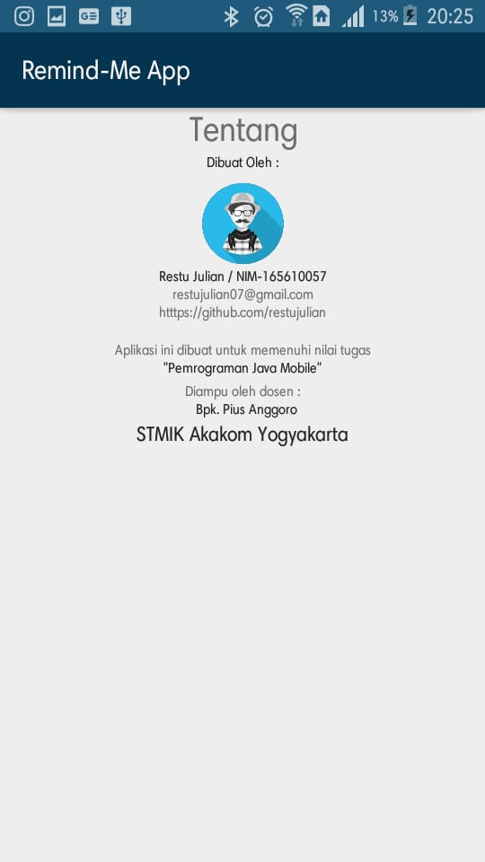
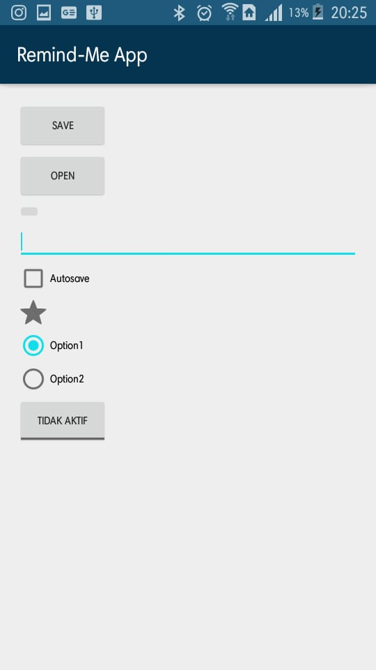
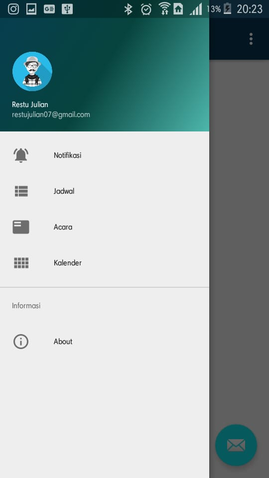
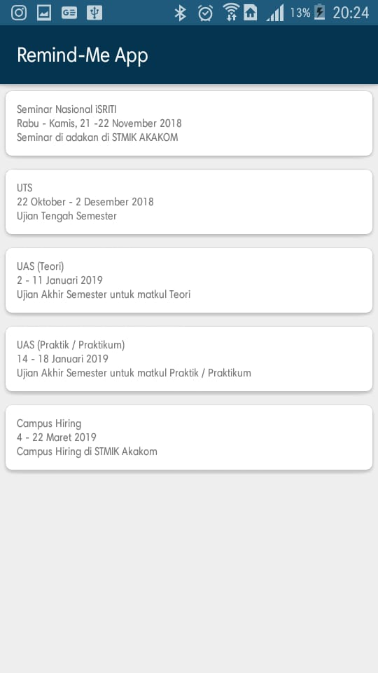
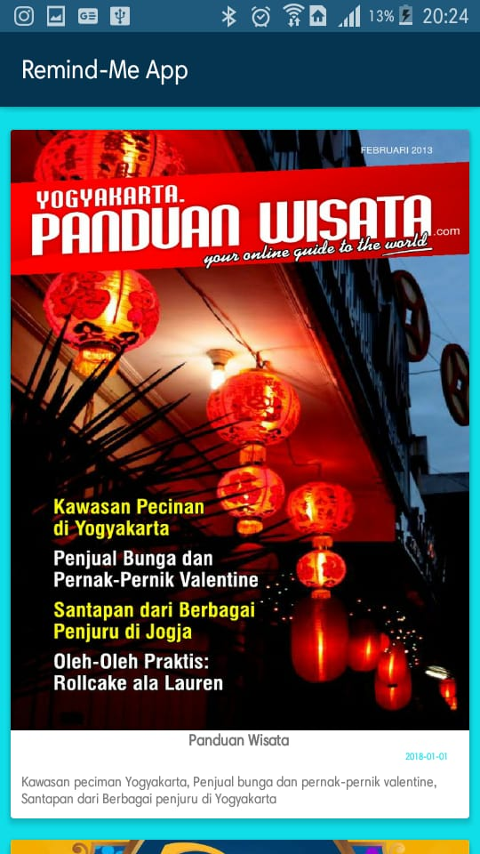
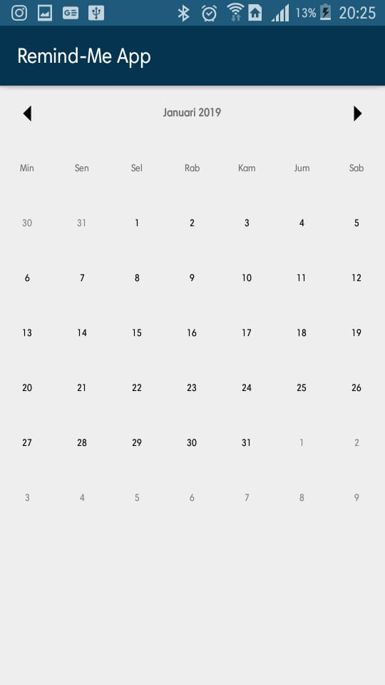

# Remind-Me App
Tugas "Pemrograman Java Mobile"

## Dibuat oleh :
  * Restu Julian / NIM-165610057

Aplikasi ini dibuat untuk memenuhi nilai tugas
Matakuliah "Pemrograman Java Mobile"
## Diampu oleh dosen : 
 * Bpk. Pius Anggoro, S.Si, M.Cs

## STMIK Akakom Yogyakarta

(Mohon menyertakan sumber jika mengcopy file disini, karena ini merupakan tugas individu)
* Review aplikasi terdapat pada directory review

#Hasil

